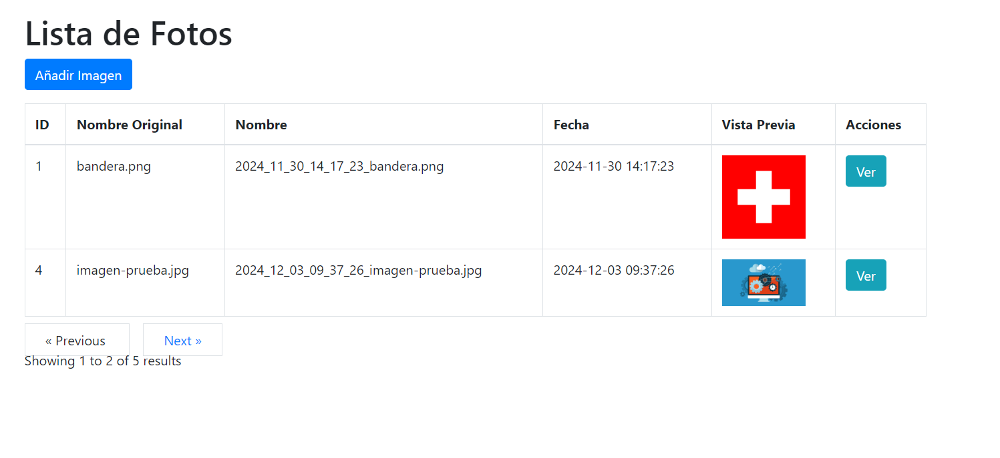
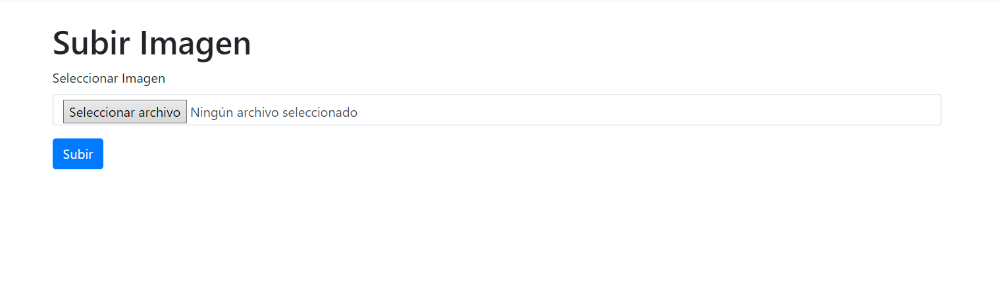

# Documentación de la Aplicación de Subida de Archivos

## Descripción
Esta aplicación permite a los usuarios subir archivos a través de una interfaz web. Está desarrollada utilizando el framework Laravel.

## Requisitos
- PHP >= 7.3
- Composer
- Laravel >= 8.x
- Servidor web (Apache, Nginx, etc.)
- Base de datos (MySQL, PostgreSQL, etc.)

## Instalación
1. Clonar el repositorio:
    ```bash
    git clone https://github.com/usuario/repo.git
    ```
2. Navegar al directorio del proyecto:
    ```bash
    cd repo
    ```
3. Instalar las dependencias:
    ```bash
    composer install
    ```
4. Copiar el archivo de configuración de entorno:
    ```bash
    cp .env.example .env
    ```
5. Generar la clave de la aplicación:
    ```bash
    php artisan key:generate
    ```
6. Configurar la base de datos en el archivo `.env`.

7. Ejecutar las migraciones:
    ```bash
    php artisan migrate
    ```

## Uso
1. Iniciar el servidor de desarrollo:
    ```bash
    php artisan serve
    ```
2. Acceder a la aplicación en el navegador:
    ```
    http://localhost:8000
    ```

## Características
- Subida de archivos
- Listado de archivos subidos
- Eliminación de archivos

## Descripción
Aquí nos encontramos con la interfaz de muestra de imágenes, están paginadas.


Aquí nos encontramos el formulario de subida de archivos.

